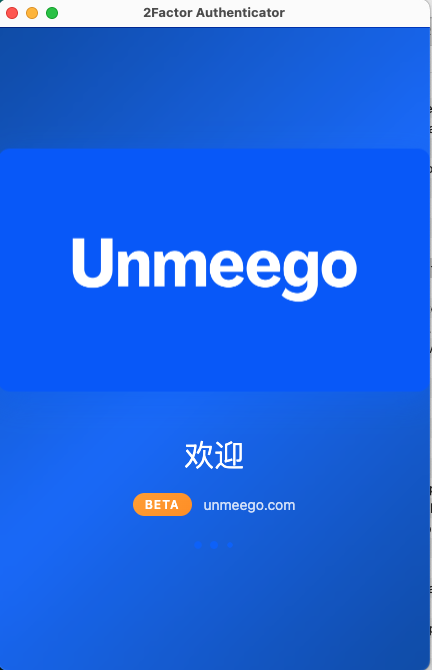
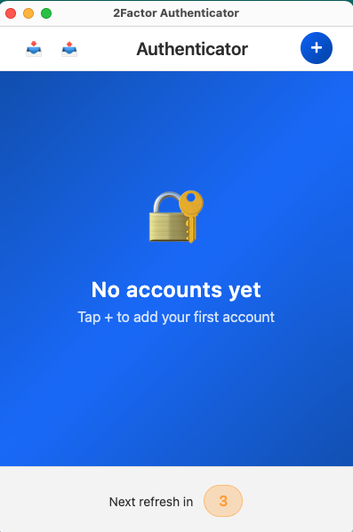
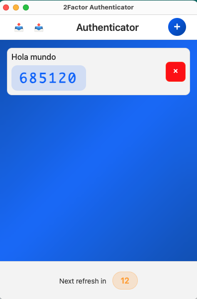

# 🔐 2Factor Authenticator by Unmeego

<div align="center">


**A beautiful, secure, and modern two-factor authentication app for macOS**

[](https://github.com/unmeego/2factor-authenticator)
[](https://www.apple.com/macos/)
[](LICENSE)

[📥 Download for macOS](#download) • [📸 Screenshots](#screenshots) • [✨ Features](#features) • [🚀 Quick Start](#quick-start) • [🌐 Website](https://unmeego.com)

</div>

---

## 🌟 Why Choose 2Factor Authenticator?

**Tired of switching between apps for your 2FA codes?** Our sleek, native macOS app brings all your authentication codes into one beautiful, secure place.

### 🎨 **Beautiful Design**
- **Modern mobile-inspired interface** with smooth animations
- **Dark/Light themes** that adapt to your workflow
- **Intuitive navigation** - feels like a premium mobile app
- **Unmeego's signature blue palette** for a professional look

### 🔒 **Privacy First**
- **100% offline** - your secrets never leave your device
- **Local SQLite storage** - no cloud, no tracking
- **Open source** - verify the code yourself
- **No analytics** - your privacy is sacred

### ⚡ **Lightning Fast**
- **Instant code generation** with TOTP standard
- **Auto-refresh every 30 seconds** with visual countdown
- **One-click copy** to clipboard
- **Smooth 60fps animations** throughout

---

## ✨ Features

| Feature | Description |
|---------|-------------|
| 🔢 **TOTP Codes** | Generate secure 6-digit codes compatible with all services |
| 📤 **Import/Export** | Backup and restore accounts with JSON files |
| 🌍 **Multi-language Welcome** | Supports 7 languages: English, Spanish, Korean, Chinese, German, French, Hindi |
| 📱 **Mobile-First Design** | Beautiful interface inspired by modern mobile apps |
| ⏱️ **Visual Timer** | Color-coded countdown shows time remaining |
| 📋 **Quick Copy** | Click any code to instantly copy to clipboard |
| 🗃️ **Local Storage** | Secure SQLite database keeps your data private |
| 🎯 **Zero Setup** | Works immediately - no accounts or configuration needed |
| 🚀 **Lightweight** | Small footprint, fast startup |

---

## 📸 Screenshots

<div align="center">

### Welcome Screen


### Main Interface


### Add Account


</div>

---

## 📥 Download

### For macOS (Apple Silicon)
**[⬇️ Download 2Factor Authenticator v1.0.0-beta](2Factor%20Authenticator-1.0.0-arm64.dmg.zip)**

*Requires macOS 10.12+ • Apple Silicon (M1/M2/M3) optimized*

---

## 🚀 Quick Start

### 1. **Download & Install**
- Download and extract the ZIP file above
- Open the DMG file
- Drag "2Factor Authenticator" to Applications folder

### 2. **First Launch (Important!)**
**Option A - Right Click Method:**
- Go to Applications folder
- **Right-click** on "2Factor Authenticator"
- Select **"Open"** from the menu
- Click **"Open"** when macOS shows security warning

**Option B - Terminal Method:**
```bash
sudo xattr -rd com.apple.quarantine "/Applications/2Factor Authenticator.app"
```
*This removes the quarantine flag from unsigned apps*

### 3. **Add Your First Account**
- Click the **+** button
- Enter account name (e.g., "Google", "GitHub")
- Paste your secret key
- Click **Add Account**

### 4. **Get Secret Keys**
When setting up 2FA on any service:
1. Look for **"Set up authenticator app"**
2. Choose **"Can't scan QR code?"** or **"Manual entry"**
3. Copy the secret key shown
4. Paste it in our app

### 5. **Use Your Codes**
- Codes refresh automatically every 30 seconds
- Click any code to copy to clipboard
- Use the copied code to log in

### 6. **Backup & Migration**
- Click **📤** to export all accounts as JSON
- Click **📥** to import accounts from JSON file
- Perfect for device migration or backup

---

## ⚠️ Security Notice

This app is **unsigned** because we don't have an Apple Developer certificate ($99/year). The "damaged app" warning is macOS protecting you from unsigned software.

**The app is safe because:**
- ✅ **Open source** - you can verify the code
- ✅ **No network access** - works completely offline  
- ✅ **Local storage only** - your data never leaves your device

---

## 📦 Backup & Migration

### 📤 **Export Your Accounts**
- Click the **📤** button in the top-left corner
- Downloads `2factor-accounts.json` with all your accounts
- **Safe to share** - contains encrypted secrets only
- Perfect for **device migration** or **backup**

### 📥 **Import Accounts**
- Click the **📥** button in the top-left corner
- Select your JSON backup file
- **Automatically adds** all valid accounts
- **No duplicates** - safely import multiple times

### 🔄 **Migration Made Easy**
1. **Export** from your old device/app
2. **Transfer** the JSON file
3. **Import** on your new device
4. **Done!** All codes working instantly

---

## 🎯 Perfect For

- **Developers** managing multiple GitHub, AWS, and service accounts
- **Security-conscious users** who want offline 2FA
- **macOS enthusiasts** who appreciate beautiful native apps
- **Teams** looking for a reliable, private 2FA solution
- **Anyone** tired of cluttered, slow authenticator apps

---

## 🛡️ Security

- **Industry-standard TOTP** (Time-based One-Time Password)
- **Local-only storage** - never synced to cloud
- **No network requests** after initial setup
- **Open source** - audit the code yourself
- **No telemetry** - we don't track anything

---

## 🌐 Supported Services

Works with **any service** that supports TOTP/2FA:

<div align="center">

**Google** • **GitHub** • **Microsoft** • **Amazon AWS** • **Dropbox** • **Facebook** • **Twitter** • **Discord** • **Slack** • **Notion** • **And hundreds more...**

</div>

---

## 🏢 About Unmeego

**2Factor Authenticator** is crafted with ❤️ by [Unmeego](https://unmeego.com) - we build beautiful, privacy-focused software for modern workflows.

### 🌟 More from Unmeego
- Visit [unmeego.com](https://unmeego.com) for more apps
- Follow us for updates on new releases
- Join our community of privacy-focused users

---

## 🔧 For Developers

### Build from Source
```bash
# Clone the repository
git clone https://github.com/unmeego/2factor-authenticator
cd 2factor-authenticator

# Install dependencies
npm install

# Run in development
npm start

# Build for production
npm run build
```

### Tech Stack
- **Electron** - Cross-platform desktop framework
- **SQLite** - Local database storage
- **OTPLIB** - TOTP code generation
- **Modern CSS** - Beautiful animations and transitions

---

## 📄 License

MIT License - feel free to use, modify, and distribute.

---

<div align="center">

**Made with ❤️ by [Unmeego](https://unmeego.com)**

[📥 Download Now](2Factor%20Authenticator-1.0.0-arm64.dmg.zip) • [🌐 Visit Website](https://unmeego.com) • [📧 Contact Us](mailto:hello@unmeego.com)

---

*Secure your digital life with style* ✨

</div>